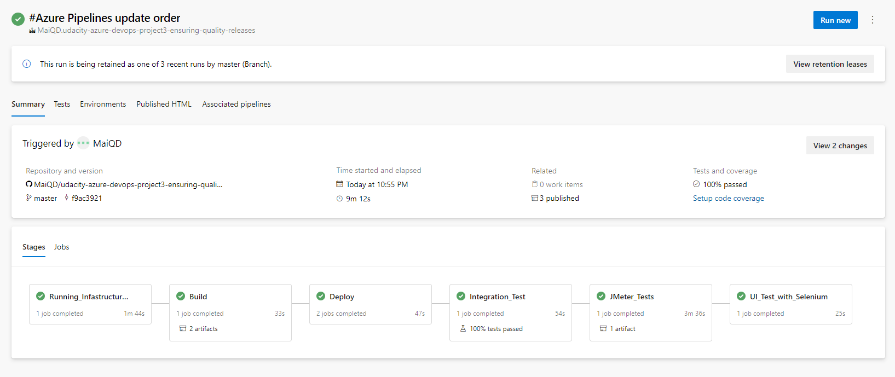

# Azure Project: Ensuring Quality Releases Project

## Introduction

In this repository, you will use a Packer template and a Terraform template to deploy a customizable, scalable web server in Azure.

## Getting Started

1. Clone this repository

2. Download the dependencies below

3. Following the README to deploy resources.

## Dependencies

1. Create an [Azure Account](https://portal.azure.com)
2. Create an [Azure DevOps Account](https://dev.azure.com/)
3. Install the [Azure command line interface](https://docs.microsoft.com/en-us/cli/azure/install-azure-cli?view=azure-cli-latest)
4. Install [Terraform](https://www.terraform.io/downloads.html)
5. Install [JMeter](https://jmeter.apache.org/download_jmeter.cgi).
6. Install [Postman](https://www.postman.com/downloads/).
7. Download the latest [Chrome driver](https://sites.google.com/a/chromium.org/chromedriver/)
8. Install Selenium
```bash
  pip install -U selenium
  sudo apt-get install -y chromium-browser
```
9. Install [Terraform Extensions for Azure DevOps](https://marketplace.visualstudio.com/items?itemName=ms-devlabs.custom-terraform-tasks)
## Instructions
### 1. Config Terraforms variables
1.1. Service principal client secret

Run following command to get the subscription id:
```bash
az account list
```
The subscription id is the first column of the output.
```json
[
  {
    "cloudName": "AzureCloud",
    "homeTenantId": "",
    "id": "<SUBSCRIPTION ID>",
    "isDefault": true,
    "managedByTenants": [],
    "name": "pay as you go subscription",
    "state": "Enabled",
    "tenantId": "",
    "user": {
      "name": "",
      "type": ""
    }
  }
]
```
Using the subscription id, you can create Service Principal and get the client id and secret.

```bash
az ad sp create-for-rbac --role="Contributor" --scopes="/subscriptions/SUBSCRIPTION_ID"
```
The output is:
```json
{
	"appId": "<APP ID>",
	"password": "<PASSWORD>",
	"displayName": "azure-cli-2022-07-04-10-13-28",
	"tenantId": "<TENANT ID>"
}
```
- <b>appId</b> is the client_id defined in file terraform.tfvars.
- <b>password</b> is the client_secret defined in file terraform.tfvars.
- <b>tenant</b> is the tenant_id defined in file terraform.tfvars.

1.2. Store terraform state in Azure Storage

Run following command to get the get the key of the storage to store state in azure azure storage:
```bash
az storage account keys list --resource-group $RESOURCE_GROUP_NAME --account-name $STORAGE_ACCOUNT_NAME --query '[0].value' -o tsv
```
Fill the value of the key in the output and information of your storage account in file <b>main.tf from line 10 to 13</b>.

1.3. Generate a new ssh key for connect to the VM

Follow [instructions](https://docs.microsoft.com/en-us/azure/virtual-machines/linux/mac-create-ssh-keys) to generate ssh key. <b>Fill the path of the public key to variable ssh_public_key_path in file terraform.tfvars line 19</b>.
### 2. Create resources using Terraform
Go to the directory terraform.
Run following command to create resources:
```bash
terraform init
terraform plan -out solution.plan
terraform apply "solution.plan"
```
When you want to destroy the resources, run the following command:
```bash
terraform destroy
```
### 3. Create the tasks that allow for Terraform to run and create the resources
1. Login to Azure [DevOps](https://dev.azure.com/) and create a new project.
2. Go to Project Settings and click on the Service connection.
3. Click on new service connection. Choose Azure Resource Manager. Then choose Service Principal (automatic).
4. Go to Pipeline > Library > Sercure files
5. Add 3 files to the library:
    - id_rsa.pub (public key from the ssh key we created in step 1)
    - id_rsa (secret key from the ssh key we created in step 1)
    - terraform.tfvars (terraform variables file)
    
### 4. Go to the VM and download chrome driver
1. Go to the VM and download the chrome driver.
2. Unzip the chrome driver.
3. Copy the chrome driver to the directory of the VM.
4. Copy the path of the chrome driver to the <code>azure-pipelines.yaml</code> file line <code>279</code>.

### 5. Alert and Monitor
1. Create alert 404
- Go to App service > Alert
- Create alert rule with action group send email when app recieve 404 code
2. Create custom logs for selenium files in the VM
- Go to Azure Logs Analytics > Custom Logs
- Create a new custom log with the following name: <b>selenium_logs</b>
- Add path to the custom log: <b>/home/datmq1/azagent/_work/1/selenium/logs/ui-logs.log</b>
- Connect the VM to the the Log Analytics workspace. <b>Importance: Config VM network outbound to allow port 443-https</b>
## Output

> <b>Running_Infastructure_as_Code</b>: using Terraform to create resources in Azure

> <b>Build</b>: Build the FakeRestAPI project, zip selenium test suits and publish artifacts to the Azure DevOps pipeline 

> <b>Deploy</b>: Deploy the FakeRestAPI project to Azure. Deploy the selenium to Azure VM.

> <b>Integration_Test</b>: Using Newman to test regression and validate the API from Postman file.

> <b>JMeter_Test</b>: Using Jmeter to stress test and endurance test the API.

> <b>UI_Test_with_Selenium</b>: Using Selenium to test the UI.
## References:
- https://registry.terraform.io/providers/hashicorp/azurerm/latest/docs/guides/service_principal_client_secret
- https://docs.microsoft.com/en-us/azure/developer/terraform/store-state-in-azure-storage?tabs=powershell
- https://docs.microsoft.com/en-us/azure/virtual-machines/linux/mac-create-ssh-keys
- https://docs.microsoft.com/en-us/azure/devops/pipelines/tasks/utility/install-ssh-key?view=azure-devops
- https://achrafbenalaya.com/2021/10/25/configure-postman-newman-api-tests-in-azure-devops/
- https://marketplace.visualstudio.com/items?itemName=LakshayKaushik.PublishHTMLReports&targetId=51ab0e12-dad6-4865-9031-38717aa65e6e&utm_source=vstsproduct&utm_medium=ExtHubManageList
- https://docs.microsoft.com/en-us/azure/devops/pipelines/publish-pipeline-artifact?view=azure-devops&tabs=yaml
https://docs.microsoft.com/en-us/azure/azure-monitor/agents/data-sources-custom-logs